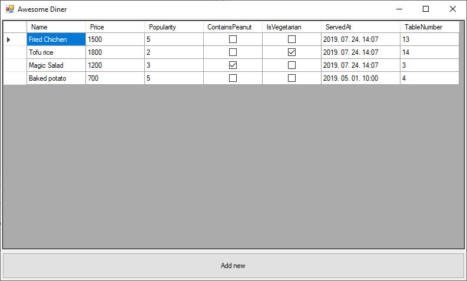
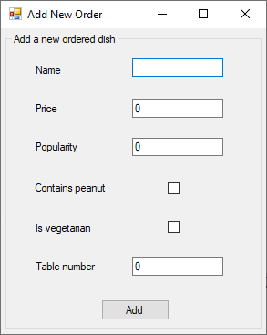

# Layout, Data Binding and Data Grid

On this day you are getting familiar with the DataGrid concepts.

## Materials & Resources

### Layout

| Layout                                                                                                                                   |      |
| :--------------------------------------------------------------------------------------------------------------------------------------- | ---: |
| [Layout in Windows Forms Controls](https://docs.microsoft.com/en-us/dotnet/framework/winforms/controls/layout-in-windows-forms-controls) | docs |
| [TabControl](https://docs.microsoft.com/en-us/dotnet/api/system.windows.forms.tabcontrol?view=netframework-4.8)                          | docs |
| [SplitContainer](https://docs.microsoft.com/en-us/dotnet/api/system.windows.forms.splitcontainer?view=netframework-4.8)                  | docs |
| [TableLayoutPanel](https://docs.microsoft.com/en-us/dotnet/api/system.windows.forms.tablelayoutpanel?view=netframework-4.8)              | docs |
| [FlowLayoutPanel](https://docs.microsoft.com/en-us/dotnet/api/system.windows.forms.flowlayoutpanel?view=netframework-4.8)                | docs |

### Data Binding

| Material                                                                                                                                 | Time |
| :--------------------------------------------------------------------------------------------------------------------------------------- | ---: |
| [Winforms Data Binding](https://www.youtube.com/watch?v=9f7IoKQIraQ)                                                                     | 7:52 |
| [Winforms Manual Databinding](https://www.youtube.com/watch?v=lQbmNWGVI88)                                                               | 9:43 |
| [Windows Forms Data Binding](https://docs.microsoft.com/en-us/dotnet/framework/winforms/windows-forms-data-binding)                      | docs |
| [Windows Forms Data Binding (Behind the Scenes)](https://docs.microsoft.com/en-us/previous-versions/dotnet/articles/aa480734(v=msdn.10)) | docs |
| [Change Notification in Windows Forms Data Binding](https://docs.microsoft.com/en-us/dotnet/framework/winforms/change-notification-in-windows-forms-data-binding) | docs |

### Data Grid

| DataGridView                                                                                                                              | Time |
| :---------------------------------------------------------------------------------------------------------------------------------------- | ---: |
| [C# DataGridView Tutorial](https://www.youtube.com/playlist?list=PLFDH5bKmoNqyDKntkVv-NURTAlPIhMPqA)                                      |      |
| [C# Tutorial - Search DataGridView by using TextBox](https://www.youtube.com/watch?v=g0qy7_l7vFg)                                         | 7:02 |
| [DataGridView Class](https://docs.microsoft.com/en-us/dotnet/api/system.windows.forms.datagridview?view=netframework-4.8)                 | docs |
| [DataGridView DataSource](https://docs.microsoft.com/en-us/dotnet/api/system.windows.forms.datagridview.datasource?view=netframework-4.8) | docs |
| [DataGridView Control](https://docs.microsoft.com/en-us/dotnet/framework/winforms/controls/datagridview-control-windows-forms)            | docs |

#### Optional

- [How to: Create a Bound Control and Format the Displayed Data](https://docs.microsoft.com/en-us/dotnet/framework/winforms/how-to-create-a-bound-control-and-format-the-displayed-data)
- [User Input Validation in Windows Forms](https://docs.microsoft.com/en-us/dotnet/framework/winforms/user-input-validation-in-windows-forms)

### Useful links

- https://stackoverflow.com/questions/2054667/in-tablelayoutpanel-if-dock-fill-and-autosize-true-then-last-column-row-occu
- https://docs.microsoft.com/en-us/dotnet/framework/winforms/controls/best-practices-for-the-tablelayoutpanel-control
- https://docs.microsoft.com/en-us/dotnet/framework/winforms/controls/walkthrough-arranging-controls-on-windows-forms-using-a-tablelayoutpanel
- https://www.oipapio.com/question-1683834

## Material Review

### Layout

- Why should we use layout containers such as TableLayoutPanel or FlowLayoutPanel?
- What's the difference between TableLayoutPanel and SplitContainer?
- What does the Dock property do?
- What's the use of containers like TabControl and GroupBox?

### Data Binding

- What is a Data Source?
- What could be a Data Source? Please tell a few examples.
- What is Data Binding and what are the benefits?
- What's a BindingSource?
- What's the difference between simple binding vs list-based binding?
- What is change notification?
- What is one-time, one-way and two-way data binding?

### Data Grid

- What is the DataGridView?
- What are the most important parts of a DataGridView?
- What kind of data could be represented in a DataGridView?
- What kind of actions can you perform with a DataGridView?
- How to allow users to add or modify data in the control?
- What is a valid DataSource in terms of a DataGridView?

## Workshop

### Improve the layout of the P2P Chat app

Go back to the project you created yesterday and improve the layout of the application. Use multiple `TableLayoutPanel`, `FlowLayoutPanel` and `GroupBox` controls to achieve a nice fluid layout.

### Data Binding

Go back to the exercises in day 2 and 3 and improve the code by using Data Binding for every control possible.

### The Awesome Diner application

Create an application, which contains a DataGrid displaying a restaurant's orders:
- Every dish should have the following properties
  - Name
  - Price
  - Popularity (1-5)
  - ContainsPeanut
  - IsItVegetarian
  - ServedAt (time of serving the dish for the guest)
  - TableNumber
- If a dish has been ordered multiple times (eg. Tomato soup) please add new entries for each and every one, maybe someone asks for it with peanuts sometimes.

#### Data Source

In a real world app the data source is usually a database, but this time use the following CSV file as a data source:
[CSV file](../assets/data.csv)

### Add a new order

Clicking on the "Add" button will open a window called "Add new order".

Note that this window has a fixed size and appears as a modal window (i.e. the user can't use the other windows of the application while it's open).

**Add validation**: the name is required and must be at least 1 character long, the popularity must be between 1 and 5.

> Hint: in WinForms you can use the `Validating` event of the text box, and the Error Provider Control to have nice validation message.

After the user provided valid data and clicked on the "Add" button the window closes and the new item is added to the list.

The new item is also save to the CSV file.

### Harder exercises

- Create a filterbar for the list
  - which is above of the table area (other WinForms component, like dropdowns or other elements)
  - which can filter for multiple columns as well
  - which has implemented filter for string, number, boolean, date type column values - bind please these types to the matching columns
- I can sort the list of orders by clicking on the column headers (A -> Z; Z -> A)

### Improving the Awesome Diner application

If you have finished the base, you can build upon that with the following recommendation, also feel free to extend the functionalities with your own ideas:
- Extend the application with a second and third table (DataGrid)
- One should contain all the staff members of the diner
- The other should contain groups created from the members
- Layout
  - plan a layout, which is fluid regarding the app window's size
  - contains a TabControl, which contains the GridViews one by one on a separate tab
- Rules regarding the staff
  - every member has to be in a group
  - a group has to have at least one member
  - staff member has to fill one of the following roles: chef, scullion, waiter/waitress, cashier, kitchen side cleaner, customer side cleaner
  - every staff member can have multiple roles
  - every group has to have: 1 chef, 1 scullion, 1 cashier
- Extend the first table with a new data/column
  - group name, the name of the group who was on duty when the dish was served.
  - order date - this is going to be the time, when the order was submitted by the customer and the served date will be the time, when it was delivered for the customer
- Reporting
  - add a button at the bottom of the app-screen
  - this will generate a summary about the groups performance
  - the result should be inserted into a new list (DataGrid) with the following columns: group name, order count, summary of income, average serving time (in minutes)
  - this list should be opened in a new Form, and should turn the parent Form unavailable/inactive, until it's not closed.
