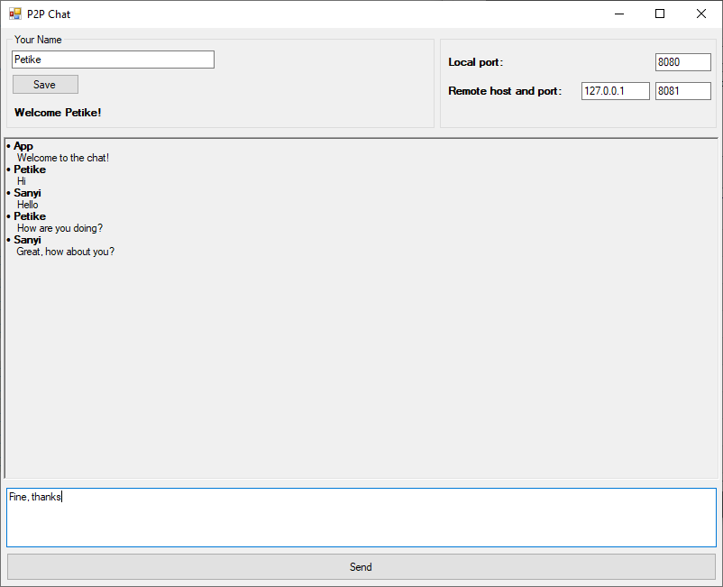

# Peer to Peer Chat application

*Write a chat application that connects to other peer applications and chat your
fellow Green Foxers*

### Create the app layout

This is how the application should look like:



- Create a text box and a button for the username
- Create input fields for local port, and remote host and port
- Create an input field for the new message with a Send button at the bottom of the window
- Create a message area where are the previous messages appear

Bonus exercise: 💪

Make the layout in a way that it can be resized nicely, i.e. if you make the window larger the top and bottom section should remain the same size and the middle area becomes larger in proportion.

[See this image for an example.](./assets/layout_enlarged.png)

### Save new message

Add a list of messages to your main area. Each message should have a username and a text field.

The app should have a default message in its list:

```
username: App
text: Hi there! Submit your message using the send button!
```

All the other messages should appear under this message.

If the send button is clicked, it should store a new message in the list and it should show up in the main area. Each message has:

- username
- text
- timestamp when the message was created
- Random generated id (between 1000000 - 9999999)

### Send the message

Once the new message is displayed it is sent to the remote app using a TCP client with the given host and port.

#### Message format

Sent the message in the following format using UTF-8 encoded strings:

```
username|text|timestamp|id
```

E.g.

```
Petike|How are you doing?|2018-05-25T14:24:25|3245435
```

### Receive new message

Implement a TCP server which received a message in the format described above. The server must listen on the given port in the text box.

### Try it with your fellows
Find one of your classmates and connect your deployed applications by setting the IP addresses, in the environment variables. If it works, invite more and more peers to the circle. The goal is to make a circle from each of the applications written by the Green Foxers.

## Optional Tasks

### Group chat: Forward received message

The next step is to have "group chat" functionality. You can achieve that by chaining computers together and forwarding every received message to your peer unless the message was originally sent by you.

When the application receives a message from a peer, and the message is not originally broadcasted by the application, then it should forward the message to the stored peer. All message and client details should be the same as the received message. If the message was broadcasted originally by the application, than it should not forward the message again.

### List of users

Create a window that shows all the usernames that occurred in the messages. The window should appear when you click on the "Show all users" button on the main window. All the usernames should be marked that has written a message less than 10 minutes ago.

### Message archive

Before exiting the application save all the messages to a file with the current date and time in the file name, e.g. `2019-07-22T14:05.txt`.
Create a new form where users can browse all the archived messages, e.g. on the left hand side use a list of archive files available and then list the contents of the selected file.