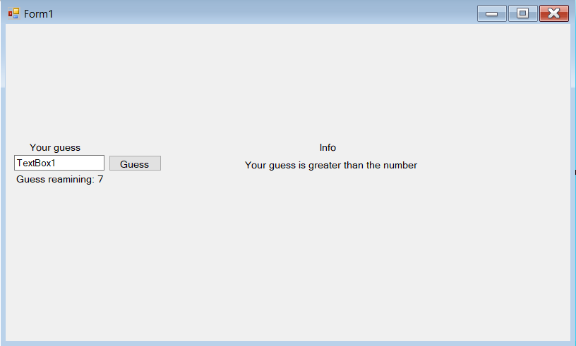

# Guessing game
Create a WinForms application that simulates a guessing game.

#### Example form

#### Description

- The application generates a random number between 1-100
- The TextBox1 accepts your guess
- The Label under the info label gives you a hint
  - If your guessed number is greater than the generated number :
    - Your guess is greater than the number
 -  If your guessed number is lesser than the generated number :
    - Your guess is lesser than the number
- You have 7 guesses to win the game
- The label under TextBox1 shows your remaining guesses
- If you run out of guesses or you guess the number a window should pop up that either congratulates you for winning the game or it says that you lost and shows the number you supposed to guess

### Optional

- Instead a label use a progress bar to visualize your reamining guesses
- Create a ListBox that will function as a guessing history
- Make the ListBox scrollable 