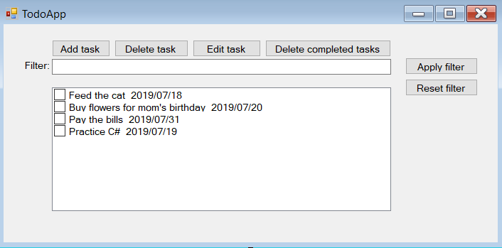
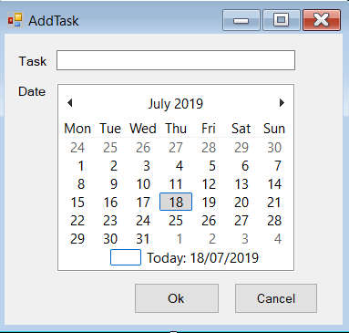
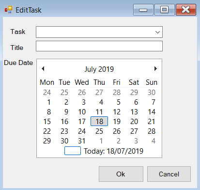

# ToDo application

Create a WinForms application that can help you manage your daily tasks.

### Example

Create a `Task` class with the following properties:
 - Title
 - Date
 - IsDone

When the `Add task` button is clicked the following form pops up:

 

- Here you can set your task's title and the due date
  - By clicking on the `Ok` button the main form pops up and the task is present in the `CheckedListBox`
  - By clicking on the `Cancel` button the main form pops up

- When the `Edit task` button is clicked the following form pops up:

- Here you can select the task you want to edit
  - You can edit the title and the due date
  - The `Cancel` and `Ok` button behaves as expected

- By clicking on the `Delete` button a form pops up where you can select the task you want to delete
- By clicking on each task's checkbox it should set the selected task's `IsDone` property to true
- By clicking on the `Delete completed tasks` button all the checked tasks are deleted
- By clicking on the `Apply filter` button: 
  - The application checks the content of the `TextBox`
  - In the `CheckedListBox` only those tasks are present which title's contains the string from the `TextBox`
  - If the `TextBox` is empty then nothing happens
- By clicking on the `Reset filter` button:
  - It clears out the content of the `TextBox`
  - Every task is present in the `CheckedListBox`

